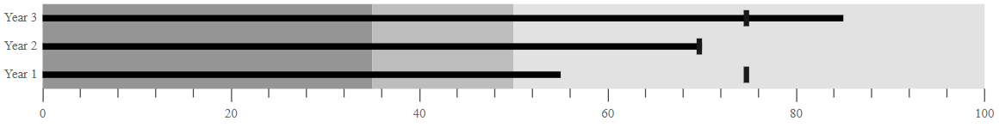
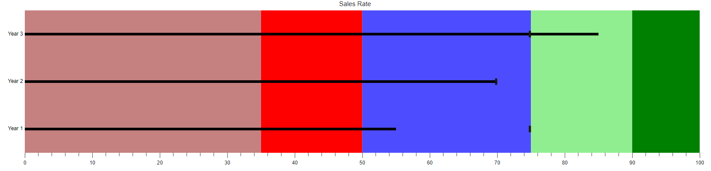

# Ranges in ASP.NET Core Bullet Chart

Add a range by including an `<e-bullet-range>` element inside the `<e-bullet-range-collection>` child of the Bullet Chart.

Ranges represent qualitative categories such as **Good**, **Bad**, and **Satisfactory** along the Bullet Chart scale. The end of a range is specified by the [`end`](https://help.syncfusion.com/cr/aspnetcore-js2/Syncfusion.EJ2.Charts.Range.html#Syncfusion_EJ2_Charts_Range_End) property within [`ranges`](https://help.syncfusion.com/cr/aspnetcore-js2/Syncfusion.EJ2.Charts.BulletChart.html#Syncfusion_EJ2_Charts_BulletChart_Ranges). The starting point of the first range is the [`minimum`](https://help.syncfusion.com/cr/aspnetcore-js2/Syncfusion.EJ2.Charts.BulletChart.html#Syncfusion_EJ2_Charts_BulletChart_Minimum) value of the quantitative scale, or the end of the previous range.






...
public class Range
{           
    public double value;
    public double target;
    public string category;
}



## Color customization

Enhance the readability of ranges with color and opacity. It can be applied using the [`Color`](https://help.syncfusion.com/cr/aspnetcore-js2/Syncfusion.EJ2.Charts.Range.html#Syncfusion_EJ2_Charts_Range_Color) and [`Opacity`](https://help.syncfusion.com/cr/aspnetcore-js2/Syncfusion.EJ2.Charts.Range.html#Syncfusion_EJ2_Charts_Range_Opacity) properties in [`Ranges`](https://help.syncfusion.com/cr/aspnetcore-js2/Syncfusion.EJ2.Charts.BulletChart.html#Syncfusion_EJ2_Charts_BulletChart_Ranges).






...
public class Custom
{           
    public double value;
    public double target;
    public string category;
}



