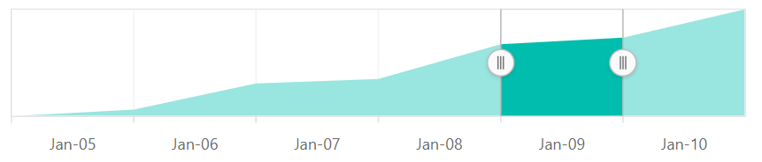

# Selecting Range in ASP.NET Core Range Navigator

The Range Selector's left and right thumbs are used to indicate the selected range in the large collection of data. A range can be selected in the following ways:

* By dragging the thumbs.
* By tapping on the labels.
* By setting the start and the end through the `value` property.










