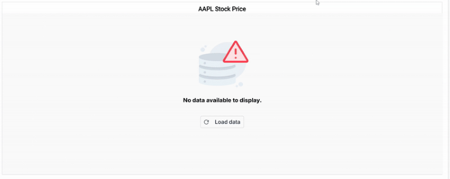

<!-- markdownlint-disable MD036 -->

# Working with Data in ASP.NET Core Stock Chart

Chart can visualise data bound from local or remote data.

## Local Data

You can bind a simple JSON data to the chart using [`dataSource`](https://help.syncfusion.com/cr/aspnetcore-js2/Syncfusion.EJ2.Charts.StockChartStockChartSeries.html#Syncfusion_EJ2_Charts_StockChartStockChartSeries_DataSource) property in series.










## Handling No Data

When no data is available to render in the stock chart, the `noDataTemplate` property can be used to display a custom layout within the chart area. This layout may include a message indicating the absence of data, a relevant image, or a button to initiate data loading. Styled text, images, or interactive elements can be incorporated to maintain design consistency and improve user guidance. Once data becomes available, the chart automatically updates to display the appropriate visualization.










## Live Stock Chart

The Stock Chart can be updated in real time by pushing new and modified OHLC (open, high, low, close, volume) values into an existing candle series without re-rendering the entire chart. This is achieved with the help of the [`addPoint`](https://help.syncfusion.com/cr/aspnetcore-js2/Syncfusion.EJ2.Charts.StockChartStockChartSeries.html#addpoint) and [`setData`](https://help.syncfusion.com/cr/aspnetcore-js2/Syncfusion.EJ2.Charts.StockChartStockChartSeries.html#setdata) methods exposed on a [`StockSeries`](https://help.syncfusion.com/cr/aspnetcore-js2/Syncfusion.EJ2.Charts.StockChartStockChartSeries.html) instance.

* `setData(point, animationDuration)` – replaces the current forming candle with the supplied point. Use this when you want to update the price of the candle that is currently being built.
* `addPoint(point, animationDuration)` – appends a brand-new candle to the end of the series. Use this when a new time bucket starts (for example, every new minute on a one-minute candle).

A typical real-time workflow uses both methods together:

1. Start with a set of historical candles loaded through `dataSource`.
2. On every tick, call `setData` to mutate the values of the in-progress candle.
3. When the candle interval elapses, call `addPoint` to begin a new candle whose open price matches the previous close.

In the following example, simulated one-minute OHLC data is generated locally and the chart is updated every 100 ms (using `setInterval`) to demonstrate live behavior. The forming candle is updated with `setData`, and a new candle is appended with `addPoint` every ten ticks.










## See Also

* [Series Types](./series-types)
