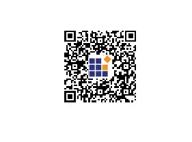

# QR Code Generator in Blazor Barcode Component

## QR Code

The [Blazor QR Code](https://www.syncfusion.com/blazor-components/blazor-barcode) is a two-dimensional barcode composed of a grid of dark and light dots or blocks that form a square. The data encoded in the barcode can be numeric, alphanumeric, or Shift Japanese Industrial Standards (JIS8) characters. The QR Code uses version from 1 to 40. Version 1 measures 21 modules x 21 modules, Version 2 measures 25 modules x 25 modules, and so on. The number of modules increases in steps of 4 modules per side up to Version 40, which measures 177 modules x 177 modules. Each version has its own capacity. By default, the barcode control automatically sets the version according to the length of the input text. The QR Barcodes are designed for industrial uses and are also commonly used in consumer advertising.

```cshtml
@using Syncfusion.Blazor.BarcodeGenerator

<SfQRCodeGenerator Width="200px" Height="150px" Value="Syncfusion"></SfQRCodeGenerator>

```


## QR Code Customizations

The QR Code component provides comprehensive customization options to modify the appearance and behavior of generated QR codes. This section covers all available properties that can be used to customize QR Code symbols.

### QR Code Color Customization

The QR code appearance can be customized by changing the colors. The component provides two main color properties:

#### Foreground Color

The [ForeColor](https://help.syncfusion.com/cr/blazor/Syncfusion.Blazor.BarcodeGenerator.SfQRCodeGenerator.html#Syncfusion_Blazor_BarcodeGenerator_SfQRCodeGenerator_ForeColor) property specifies the color of the dark modules (dots) in the QR code. By default, it is set to **black**.

```cshtml
@using Syncfusion.Blazor.BarcodeGenerator

<SfQRCodeGenerator Width="200px" Height="150px" ForeColor="red" Value="Syncfusion"></SfQRCodeGenerator>

```


#### Background Color

The [BackgroundColor](https://help.syncfusion.com/cr/blazor/Syncfusion.Blazor.BarcodeGenerator.SfQRCodeGenerator.html#Syncfusion_Blazor_BarcodeGenerator_SfQRCodeGenerator_BackgroundColor) property specifies the background color of the QR code (light modules). By default, it is set to **white**. This is useful when you need to match the QR code with the surrounding environment or create custom designs.

```cshtml
@using Syncfusion.Blazor.BarcodeGenerator

<SfQRCodeGenerator Width="200px" Height="150px" BackgroundColor="lightyellow" ForeColor="darkblue" Value="Syncfusion"></SfQRCodeGenerator>

```


### QR Code Dimension Customization

The dimensions of the QR code can be adjusted using the [Height](https://help.syncfusion.com/cr/blazor/Syncfusion.Blazor.BarcodeGenerator.SfQRCodeGenerator.html#Syncfusion_Blazor_BarcodeGenerator_SfQRCodeGenerator_Height) and [Width](https://help.syncfusion.com/cr/blazor/Syncfusion.Blazor.BarcodeGenerator.SfQRCodeGenerator.html#Syncfusion_Blazor_BarcodeGenerator_SfQRCodeGenerator_Width) properties. Both properties accept string values with units (px, %, em, etc.). By default, both are set to **100%**.

```cshtml
@using Syncfusion.Blazor.BarcodeGenerator

<SfQRCodeGenerator Width="250px" Height="250px" Value="Syncfusion"></SfQRCodeGenerator>

```


### Version and Error Correction Configuration

The [Version](https://help.syncfusion.com/cr/blazor/Syncfusion.Blazor.BarcodeGenerator.SfQRCodeGenerator.html#Syncfusion_Blazor_BarcodeGenerator_SfQRCodeGenerator_Version) property controls the QR code size, while [ErrorCorrectionLevel](https://help.syncfusion.com/cr/blazor/Syncfusion.Blazor.BarcodeGenerator.SfQRCodeGenerator.html#Syncfusion_Blazor_BarcodeGenerator_SfQRCodeGenerator_ErrorCorrectionLevel) specifies the error recovery capability.

```cshtml
@using Syncfusion.Blazor.BarcodeGenerator

<!-- Automatic version selection -->
<SfQRCodeGenerator Width="200px" Height="150px" Value="Syncfusion"></SfQRCodeGenerator>

<!-- Specific version with high error correction -->
<SfQRCodeGenerator Width="250px" Height="250px" 
                   Version="QRCodeVersion.Version10" 
                   ErrorCorrectionLevel="ErrorCorrectionLevel.High" 
                   Value="This QR code can recover from significant damage"></SfQRCodeGenerator>

```


### Margin Customization

The [Margin](https://help.syncfusion.com/cr/blazor/Syncfusion.Blazor.BarcodeGenerator.SfQRCodeGenerator.html#Syncfusion_Blazor_BarcodeGenerator_SfQRCodeGenerator_Margin) property specifies the space to be left around the QR code. It accepts a `QRMargin` object with the following properties:

| Property | Description | Default Value |
|----------|-------------|---|
| `Left` | Space from the left side | 10 |
| `Right` | Space from the right side | 10 |
| `Top` | Space from the top side | 10 |
| `Bottom` | Space from the bottom side | 10 |

All properties accept double values representing pixels.

```cshtml
@using Syncfusion.Blazor.BarcodeGenerator

<SfQRCodeGenerator Width="250px" Height="250px" Value="Syncfusion">
    <QRMargin Left="20" Top="20" Right="20" Bottom="20"></QRMargin>
</SfQRCodeGenerator>

```


### Display Text Customization

The QR code display text can be fully customized using the [DisplayText](https://help.syncfusion.com/cr/blazor/Syncfusion.Blazor.BarcodeGenerator.SfQRCodeGenerator.html#Syncfusion_Blazor_BarcodeGenerator_SfQRCodeGenerator_DisplayText) property. The `QRCodeGeneratorDisplayText` component provides comprehensive text customization options.

#### Text Content

The [Text](https://help.syncfusion.com/cr/blazor/Syncfusion.Blazor.BarcodeGenerator.QRCodeGeneratorDisplayText.html#Syncfusion_Blazor_BarcodeGenerator_QRCodeGeneratorDisplayText_Text) property specifies the textual description to display with the QR code. By default, it is an empty string.

```cshtml
@using Syncfusion.Blazor.BarcodeGenerator

<SfQRCodeGenerator Width="250px" Height="200px" Value="Syncfusion">
    <QRCodeGeneratorDisplayText Text="Text"></QRCodeGeneratorDisplayText>
</SfQRCodeGenerator>

```


#### Font Configuration

The [Font](https://help.syncfusion.com/cr/blazor/Syncfusion.Blazor.BarcodeGenerator.QRCodeGeneratorDisplayText.html#Syncfusion_Blazor_BarcodeGenerator_QRCodeGeneratorDisplayText_Font) property specifies the font style of the display text. By default, it is set to **monospace**.

```cshtml
@using Syncfusion.Blazor.BarcodeGenerator

<SfQRCodeGenerator Width="200px" Height="150px" Value="Syncfusion">
    <QRCodeGeneratorDisplayText Text="Product Information" Font="Arial"></QRCodeGeneratorDisplayText>
</SfQRCodeGenerator>

```


#### Text Size

The [Size](https://help.syncfusion.com/cr/blazor/Syncfusion.Blazor.BarcodeGenerator.QRCodeGeneratorDisplayText.html#Syncfusion_Blazor_BarcodeGenerator_QRCodeGeneratorDisplayText_Size) property specifies the size of the display text. By default, it is set to **20** pixels.

```cshtml
@using Syncfusion.Blazor.BarcodeGenerator

<SfQRCodeGenerator Width="200px" Height="150px" Value="Syncfusion">
    <QRCodeGeneratorDisplayText Text="Product Information" Size="16"></QRCodeGeneratorDisplayText>
</SfQRCodeGenerator>

```


#### Text Position

The [Position](https://help.syncfusion.com/cr/blazor/Syncfusion.Blazor.BarcodeGenerator.QRCodeGeneratorDisplayText.html#Syncfusion_Blazor_BarcodeGenerator_QRCodeGeneratorDisplayText_Position) property specifies the vertical position of the text relative to the QR code. It accepts `Top` or `Bottom`. By default, it is set to `Bottom`.

```cshtml
@using Syncfusion.Blazor.BarcodeGenerator

<SfQRCodeGenerator Width="200px" Height="150px" Value="Syncfusion">
    <QRCodeGeneratorDisplayText Text="Product Information" Position="TextPosition.Top"></QRCodeGeneratorDisplayText>
</SfQRCodeGenerator>

```


#### Text Visibility

The [Visibility](https://help.syncfusion.com/cr/blazor/Syncfusion.Blazor.BarcodeGenerator.QRCodeGeneratorDisplayText.html#Syncfusion_Blazor_BarcodeGenerator_QRCodeGeneratorDisplayText_Visibility) property controls the visibility of the display text. By default, it is set to `true`. Set it to `false` to hide the text.

```cshtml
@using Syncfusion.Blazor.BarcodeGenerator

<SfQRCodeGenerator Width="200px" Height="150px" Value="Syncfusion">
    <QRCodeGeneratorDisplayText Visibility="false"></QRCodeGeneratorDisplayText>
</SfQRCodeGenerator>

```


#### Text Margin

The [Margin](https://help.syncfusion.com/cr/blazor/Syncfusion.Blazor.BarcodeGenerator.QRCodeGeneratorDisplayText.html#Syncfusion_Blazor_BarcodeGenerator_QRCodeGeneratorDisplayText_Margin) property specifies the space between the text and the QR code. It accepts a `QRCodeTextMargin` object with the following properties:

| Property | Description | Default Value |
|----------|-------------|---|
| `Left` | Space from the left side | 0 |
| `Right` | Space from the right side | 0 |
| `Top` | Space from the top side | 0 |
| `Bottom` | Space from the bottom side | 0 |

```cshtml
@using Syncfusion.Blazor.BarcodeGenerator

<SfQRCodeGenerator Width="250px" Height="250px" Value="Syncfusion">
    <QRCodeGeneratorDisplayText Text="Product Information">
        <QRCodeTextMargin Left="5" Top="10" Right="5" Bottom="10"></QRCodeTextMargin>
    </QRCodeGeneratorDisplayText>
</SfQRCodeGenerator>

```


### Dynamic Property Updates

The QR Code component supports real-time property binding. When any property value changes, the QR code automatically updates to reflect the changes.

#### Update QR code Properties Dynamically

Here is an example showing how to dynamically update QR code properties using Blazor data binding:

```cshtml
@using Syncfusion.Blazor.BarcodeGenerator
@using Syncfusion.Blazor.Inputs
@using Syncfusion.Blazor.DropDowns

<div style="margin: 20px;">
    <div style="margin-bottom: 10px;">
        <label>QR Code Value (URL): </label>
        <SfTextBox @bind-Value="@QRValue" Placeholder="Enter URL or text"></SfTextBox>
    </div>
    
    <div style="margin-bottom: 10px;">
        <label>Foreground Color: </label>
        <input type="color" @bind="@ForeColor" />
    </div>
    
    <div style="margin-bottom: 10px;">
        <label>Background Color: </label>
        <input type="color" @bind="@BackgroundColor" />
    </div>
    
    <div style="margin-bottom: 10px;">
        <label>QR Code Size: </label>
        <SfSlider @bind-Value="@QRSize" Min="150" Max="400" Step="10"></SfSlider>
        <span>@QRSize px</span>
    </div>
    
    <div style="margin-bottom: 10px;">
        <label>Error Correction Level: </label>
        <SfDropDownList TValue="ErrorCorrectionLevel" TItem="ErrorCorrectionLevel" DataSource="@ErrorCorrectionLevels" @bind-Value="@ErrorLevel">
            <DropDownListFieldSettings Text="ToString" Value="ToString"></DropDownListFieldSettings>
        </SfDropDownList>
    </div>
    
    <div style="margin-bottom: 10px;">
        <label>Display Text: </label>
        <SfTextBox @bind-Value="@DisplayTextValue" Placeholder="Enter display text"></SfTextBox>
    </div>
</div>

<!-- QR Code that updates in real-time as properties change -->
<div style="margin-top: 30px; padding: 20px; border: 1px solid #ccc; text-align: center;">
    <SfQRCodeGenerator Width="@($"{QRSize}px")" 
                       Height="@($"{QRSize}px")" 
                       Value="@QRValue"
                       ForeColor="@ForeColor"
                       BackgroundColor="@BackgroundColor"
                       ErrorCorrectionLevel="@ErrorLevel">
        <QRCodeGeneratorDisplayText Text="@DisplayTextValue" Visibility="@(!string.IsNullOrEmpty(DisplayTextValue))"></QRCodeGeneratorDisplayText>
    </SfQRCodeGenerator>
</div>

@code
{
    private string QRValue = "https://www.syncfusion.com";
    private string ForeColor = "black";
    private string BackgroundColor = "white";
    private int QRSize = 250;
    private string DisplayTextValue = "Syncfusion QR Code";
    private ErrorCorrectionLevel ErrorLevel = ErrorCorrectionLevel.Medium;
    private List<ErrorCorrectionLevel> ErrorCorrectionLevels = new() { ErrorCorrectionLevel.Low, ErrorCorrectionLevel.Medium, ErrorCorrectionLevel.Quartile, ErrorCorrectionLevel.High };
}
```


## QR code with logo

The QR Code component supports embedding a logo image using the [ImageSource](https://help.syncfusion.com/cr/blazor/Syncfusion.Blazor.BarcodeGenerator.QRCodeLogo.html#Syncfusion_Blazor_BarcodeGenerator_QRCodeLogo_ImageSource) property within the [QRCodeLogo](https://help.syncfusion.com/cr/blazor/Syncfusion.Blazor.BarcodeGenerator.QRCodeLogo.html) element. This property sets the logo image in the center of the QR code. By default, the logo image is positioned at one-third of the QR code's size. Therefore, adjusting the size of the QR code will proportionally scale the logo image.

Advantages of Image QR Codes

* Enhanced Brand Identity: A QR code with an image allows businesses to integrate their logos or brand elements directly into the QR code. This enhances brand consistency and recognition, making it more memorable for users when they interact with the QR code.

* Increased User Interaction: An image QR code can convey messages, showcase products, or provide information more effectively than plain text or URLs. This visual approach can significantly boost user engagement and make the content more compelling and memorable.

* Comprehensive Visual Content: An image QR code generator enables the sharing of high-resolution images, infographics, diagrams, or product photos. This is particularly beneficial in art-related contexts where visual content is crucial for effective communication.

These benefits illustrate how an image QR code converter can enhance the effectiveness and impact of QR codes in various domains, from marketing to education and beyond.

The following code example demonstrates how to generate a QR barcode with a logo positioned at the center of it.

```cshtml
@using Syncfusion.Blazor.BarcodeGenerator

<SfQRCodeGenerator Width="200px" Height="150px" Value="https://www.syncfusion.com/blazor-components/blazor-barcode">
    <QRCodeGeneratorDisplayText Visibility="false"></QRCodeGeneratorDisplayText>
    <QRCodeLogo ImageSource="https://cdn.syncfusion.com/content/images/Contact-us/primary_logo.svg"></QRCodeLogo>
</SfQRCodeGenerator>
```




>**Note:** The [Error correction level](https://help.syncfusion.com/cr/blazor/Syncfusion.Blazor.BarcodeGenerator.ErrorCorrectionLevel.html) is not taken into account when rendering the logo image inside the QR code.

### Customizing the logo size

The size of the logo can be changed using the [Height](https://help.syncfusion.com/cr/blazor/Syncfusion.Blazor.BarcodeGenerator.QRCodeLogo.html#Syncfusion_Blazor_BarcodeGenerator_QRCodeLogo_Height) and [Width](https://help.syncfusion.com/cr/blazor/Syncfusion.Blazor.BarcodeGenerator.QRCodeLogo.html#Syncfusion_Blazor_BarcodeGenerator_QRCodeLogo_Width) properties of the QR code generator. The image size should be equal to or less than 30% of the QR code's size. If the specified size exceeds 30% of the QR code's size, the QR code may not be scanned properly. Therefore, the lesser value between 30% of the QR code's size and the specified size will be used for rendering.

```cshtml
@using Syncfusion.Blazor.BarcodeGenerator

<SfQRCodeGenerator Width="200px" Height="200px" Value="https://www.syncfusion.com/blazor-components/blazor-barcode">
    <QRCodeLogo Width="30" Height="30" ImageSource="images/barcode/syncfusion.png"></QRCodeLogo>
</SfQRCodeGenerator>
```


>**Note:** The default value is one-third of the QR code size.

## GS1 QR Code

GS1 QR Code is a special variant of the standard QR Code that encodes data using GS1 Application Identifiers (AIs). This enables supply chain data to be encoded in a standardized, machine-readable format. GS1 QR Codes include a GS1 prefix indicator and support multiple AIs within a single QR code, making them ideal for product identification, tracking, and information exchange in supply chain and retail environments.

Use the [EnableGS1](https://help.syncfusion.com/cr/blazor/Syncfusion.Blazor.BarcodeGenerator.SfQRCodeGenerator.html#Syncfusion_Blazor_BarcodeGenerator_SfQRCodeGenerator_EnableGS1) property on the [SfQRCodeGenerator](https://help.syncfusion.com/cr/blazor/Syncfusion.Blazor.BarcodeGenerator.SfQRCodeGenerator.html) to switch the control into GS1 mode.

**Allowed Input Characters:** GS1 QR Code supports numeric, alphabetic, and supported special characters. Data is encoded using GS1 Application Identifiers (AIs), allowing structured information such as product identifiers, batch numbers, expiration dates, serial numbers, and other business data to be stored within a single QR Code.

```cshtml
@using Syncfusion.Blazor.BarcodeGenerator

<!-- GS1 QR Code with GTIN, batch, and expiration date -->
<SfQRCodeGenerator Width="250px" Height="250px" Value="(01)09506000134352(17)271231(10)ABC123" EnableGS1="true">
    <QRCodeGeneratorDisplayText Text="Product Code" Visibility="true" Alignment="Alignment.Center" />
</SfQRCodeGenerator>
```



### GS1 QR Code with Error Correction

Combining GS1 encoding with error correction levels:

```cshtml
@using Syncfusion.Blazor.BarcodeGenerator

<!-- GS1 QR Code with high error correction -->
<SfQRCodeGenerator Width="250px" Height="250px" 
                   Value="(01)09506000134352(17)271231(10)ABC123" 
                   EnableGS1="true"
                   ErrorCorrectionLevel="ErrorCorrectionLevel.High">
    <QRCodeGeneratorDisplayText Text="Product Code" Visibility="true" Alignment="Alignment.Center" />
</SfQRCodeGenerator>
```


This configuration provides robust scanning even with partial damage to the QR code.

## Error Correction Level

The QR Barcode employs error correction to generate a series of error correction codewords which are added to the data code word sequence in order to enable the symbol to withstand damage without data loss. There are four user–selectable levels of error correction, as shown in the table, that offer the capability of recovery from the following amounts of damage. By default, the [Error correction level](https://help.syncfusion.com/cr/blazor/Syncfusion.Blazor.BarcodeGenerator.ErrorCorrectionLevel.html) is Low.

### Error Correction Levels

|Error Correction Level|	Recovery Capacity % (approx.)|
|----------|--------------|
|L (Low)|	7%|
|M (Medium)|	15%|
|Q (Quartile)|	25%|
|H (High)|	30%|

```cshtml
@using Syncfusion.Blazor.BarcodeGenerator

<!-- Low error correction (default) - compact but less robust -->
<SfQRCodeGenerator Width="150px" Height="150px" ErrorCorrectionLevel="ErrorCorrectionLevel.Low" Value="https://www.syncfusion.com"></SfQRCodeGenerator>

<!-- High error correction - larger but very robust -->
<SfQRCodeGenerator Width="200px" Height="200px" ErrorCorrectionLevel="ErrorCorrectionLevel.High" Value="https://www.syncfusion.com"></SfQRCodeGenerator>
```


Choose higher error correction levels for environments where the QR code may be damaged, printed on uneven surfaces, or scanned from difficult angles.

```cshtml
<SfQRCodeGenerator Width="200px" Height="200px" ErrorCorrectionLevel="ErrorCorrectionLevel.Low" Value=https://help.syncfusion.com/cr/blazor/Syncfusion.Blazor.BarcodeGenerator.ErrorCorrectionLevel.html>
    <QRCodeGeneratorDisplayText Visibility="false"></QRCodeGeneratorDisplayText>
</SfQRCodeGenerator>
```


## Event

[OnValidationFailed](https://help.syncfusion.com/cr/blazor/Syncfusion.Blazor.BarcodeGenerator.SfQRCodeGenerator.html#Syncfusion_Blazor_BarcodeGenerator_SfQRCodeGenerator_OnValidationFailed) event in the [SfQRCodeGenerator](https://help.syncfusion.com/cr/blazor/Syncfusion.Blazor.BarcodeGenerator.SfQRCodeGenerator.html) is triggered when the input is an invalid string.

```cshtml
@using Syncfusion.Blazor.BarcodeGenerator

<SfQRCodeGenerator Width="200px" Height="150px" Value="Syncfusion" OnValidationFailed="@OnValidationFailed"></SfQRCodeGenerator>

@code
{
    public void OnValidationFailed(ValidationFailedEventArgs args)
    {
    }
}

```

* [How can I adjust the margin of the QR code and handle text positioning when using the QRCodeGenerator in Syncfusion?](https://support.syncfusion.com/kb/article/18734/how-can-i-adjust-the-margin-of-the-qr-code-and-handle-text-positioning-when-using-the-qrcodegenerator-in-syncfusion)

* [How to export the QR code in a Blazor Server project to a desired location using a memory stream?](https://support.syncfusion.com/kb/article/17216/how-to-export-the-qr-code-in-a-blazor-server-project-to-a-desired-location-using-a-memory-stream)