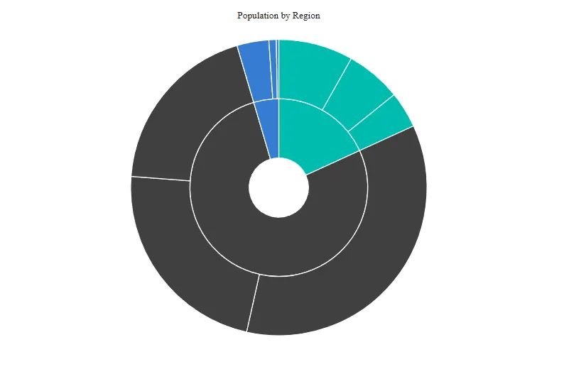

<!-- markdownlint-disable MD036 -->

# Blazor Sunburst Chart Working with Data

The `Blazor Sunburst Chart` accepts a flat collection as its `DataSource` and infers the hierarchy from four member paths: `IdMemberPath`, `ParentIdMemberPath`, `LabelMemberPath`, and `ValueMemberPath`. Each row in the collection represents a node in the hierarchy. The component then traverses the flat collection to construct the rendered hierarchy at runtime.

## Required member paths

`IdMemberPath`, `ParentIdMemberPath`, `LabelMemberPath`, and `ValueMemberPath` are all marked `[EditorRequired]`. The chart falls back to its empty-state placeholder if any of them is empty.

| Parameter | Purpose |
|---|---|
| `DataSource` | An `IEnumerable<TItem>` providing the rows to render. When `null`, the chart shows the loaded-state message; when an empty collection, it shows the no-data message. |
| `IdMemberPath` | Field providing each row's stable identifier. Comparison is ordinal and case-sensitive; values are trimmed. Duplicate normalized ids invalidate the hierarchy. |
| `ParentIdMemberPath` | Field referencing the `IdMemberPath` value of the row's parent. Null, empty, or whitespace values identify source roots attached to the synthetic root. |
| `LabelMemberPath` | Field providing the display text used in segments, data labels, legends, breadcrumbs, tooltip paths, event payloads, and accessible names. Null, empty, or whitespace values are normalized to the localized "Sunburst_Unknown" text. |
| `ValueMemberPath` | Field providing the numeric value for each row. Non-leaf rows aggregate their descendants. |

N> The chart does not auto-generate or fall back to synthetic ids. If `IdMemberPath` is missing or duplicates are present, hierarchy construction fails and the chart renders the invalid-configuration state.

## Basic binding

```cshtml

@using Syncfusion.Blazor.Charts

<SfSunburstChart TItem="RegionData"
                 Title="Population by Region"
                 DataSource="@Regions"
                 IdMemberPath="@nameof(RegionData.Id)"
                 ParentIdMemberPath="@nameof(RegionData.ParentId)"
                 LabelMemberPath="@nameof(RegionData.Label)"
                 ValueMemberPath="@nameof(RegionData.Population)"
                 Width="100%" Height="600px">
</SfSunburstChart>

@code {
    public class RegionData
    {
        public string Id { get; set; } = string.Empty;
        public string? ParentId { get; set; }
        public string Label { get; set; } = string.Empty;
        public double Population { get; set; }
    }

    public List<RegionData> Regions = new List<RegionData>
    {
        new RegionData { Id = "USA", ParentId = null, Label = "USA", Population = 331 },
        new RegionData { Id = "India", ParentId = null, Label = "India", Population = 1408 },
        new RegionData { Id = "Germany", ParentId = null, Label = "Germany", Population = 83 },
        new RegionData { Id = "USA-California", ParentId = "USA", Label = "California", Population = 39 },
        new RegionData { Id = "USA-Texas", ParentId = "USA", Label = "Texas", Population = 29 },
        new RegionData { Id = "USA-NewYork", ParentId = "USA", Label = "New York", Population = 19 },
        new RegionData { Id = "India-Maharashtra", ParentId = "India", Label = "Maharashtra", Population = 112 },
        new RegionData { Id = "India-TamilNadu", ParentId = "India", Label = "Tamil Nadu", Population = 72 },
        new RegionData { Id = "India-Karnataka", ParentId = "India", Label = "Karnataka", Population = 61 },
        new RegionData { Id = "Germany-Bavaria", ParentId = "Germany", Label = "Bavaria", Population = 13 },
        new RegionData { Id = "Germany-Berlin", ParentId = "Germany", Label = "Berlin", Population = 3 },
        new RegionData { Id = "Germany-Hamburg", ParentId = "Germany", Label = "Hamburg", Population = 1 }
    };
}

```



## Hierarchy validation rules

When binding flat data, the chart applies the following deterministic validation rules:

- **Missing or duplicate ids** — If `IdMemberPath` resolves to null, empty, or whitespace for any row, or if two rows resolve to the same normalized id, the complete hierarchy is invalidated. The chart emits one deterministic configuration diagnostic and renders the invalid-configuration state. No partial hierarchy is rendered.
- **Self-references and cycles** — A row whose `ParentIdMemberPath` resolves to its own id, or whose parent chain contains itself, invalidates the hierarchy. The chart does not attempt to recover or break cycles.
- **Unresolvable parents** — A row whose `ParentIdMemberPath` resolves to a value that does not match any other row's normalized id invalidates the hierarchy. Whitespace or case mismatches are not normalized away.
- **Multiple roots** — Multiple rows whose `ParentIdMemberPath` resolves to null, empty, or whitespace are valid. Each root is attached to the synthetic hidden root at the center of the chart.
- **Depth** — The chart enforces a maximum depth of 100 levels and recommends no more than 20 levels for usability and performance. See the [Levels](levels.md) topic.

## Bind via reflection on the model

`IdMemberPath`, `ParentIdMemberPath`, `LabelMemberPath`, and `ValueMemberPath` use reflection at render time. Provide the property name as a string; the chart reads each row's corresponding property once during render.

```cshtml

<SfSunburstChart TItem="RegionData"
                 DataSource="@Regions"
                 IdMemberPath="Id"
                 ParentIdMemberPath="ParentId"
                 LabelMemberPath="Label"
                 ValueMemberPath="Population">
</SfSunburstChart>

```

Use `nameof(RegionData.Id)` (and so on) to make the binding refactor-safe across renames.

## Numeric values and culture

Numeric values are read as `double`. The chart formats values with `CultureInfo.InvariantCulture` for export; for display labels and tooltips, the chart uses the supplied or default culture. Empty values are treated as zero; missing values do not render a segment.

## Updating data

Update `DataSource` to add, remove, or change rows. The chart rebuilds the hierarchy on the next render and preserves node identity by `IdMemberPath`. Existing selections and drill focus are reset when the focused id is no longer present in the rebuilt hierarchy.

## See also

* [Data Label](./data-label)
* [Legend](./legend)
* [Selection](./selection)