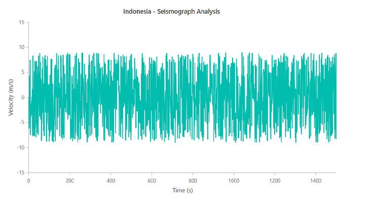
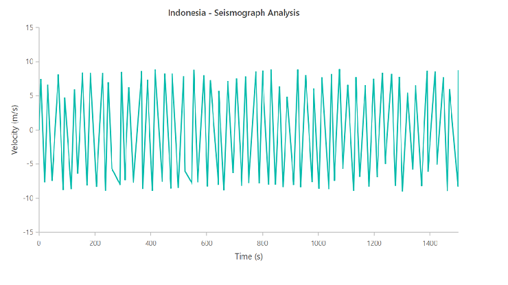

# How to down sample data in JavaScript Chart

Down sampling is the process of reducing the data rate. We have given a 2000 data points for chart. After applying down sampling algorithm, chart data points has been reduced  and rendered with 400 data points.

Down sampling data using the "Largest-Triangle-Three-Buckets algorithm"[`LTTB`](https://gist.github.com/FraserChapman/649f1aba28f6bc941d5c) which describes the point in the bucket that forms the largest triangle using the area of the triangles. This helps to reducing the number of points.

In Down sampling when we perform zooming, particular level of zoomed chart we can see the chart clearly with original data, so we can use original data for that level of zooming. This can be achieved by [`zoomComplete`](../../api/chart#zoomcomplete) event. Refer the below sample for down sampling with zooming feature.











**Before applying down sampling algorithm**

**After applying down sampling algorithm**

