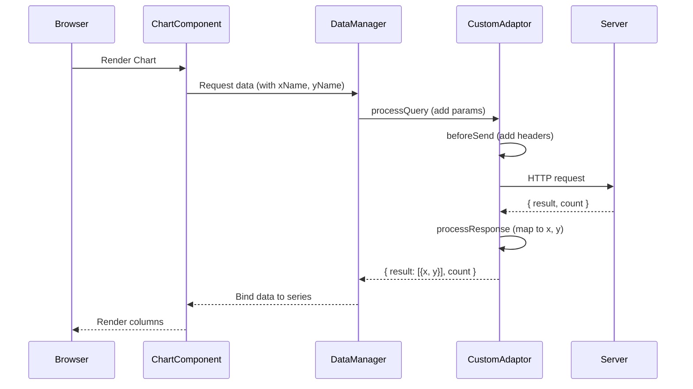

# Custom Remote Data Binding in React Charts

The Custom adaptor in the React Chart is an extension mechanism that customizes any existing adaptor (such as [`UrlAdaptor`](https://ej2.syncfusion.com/react/documentation/data/adaptors/url-adaptor)) to meet specific application requirements. Instead of creating an entirely new adaptor from scratch, a Custom adaptor extends and modifies the behavior of an existing adaptor by intercepting and customizing HTTP requests and responses.

For detailed guidance, refer to the [DataManager CustomAdaptor documentation](https://ej2.syncfusion.com/react/documentation/data/adaptors/custom-adaptor), which explains the usage of custom adaptors in depth.

Once the project creation and backend setup are complete, the next step is to render the React Chart component on the client side.

## React Chart setup and client-side configuration

After finishing the backend setup, the next step is to integrate the React Chart on the client side by following these instructions.

### Step 1: Installing Syncfusion packages

Open a terminal in the `client` folder, confirm that `package.json` is present, and run the following commands to install the required Syncfusion packages:

```bash
npm install @syncfusion/ej2-react-charts --save
npm install @syncfusion/ej2-data --save
```

### Step 2: Add CSS styles

Open `src/index.css` and add the required Syncfusion Chart styles:

```css
@import '../node_modules/@syncfusion/ej2-base/styles/material.css';
```

Import the stylesheet in the `main.jsx` application entry point:

```jsx
import { StrictMode } from 'react';
import { createRoot } from 'react-dom/client';
import './index.css';
import App from './App.jsx';

createRoot(document.getElementById('root')).render(
  <StrictMode>
    <App />
  </StrictMode>
);
```

### Step 3: Create the Custom Adaptor

Integrating a Custom adaptor with the React Chart requires configuring the [`DataManager`](https://ej2.syncfusion.com/react/documentation/data/getting-started) as the communication bridge between the Chart component and the backend data source. The Custom adaptor serves as a customization layer that provides complete control over how data is requested and how the response is transformed before being rendered by the Chart.

#### Step 3.1: Creating an Extended UrlAdaptor:

The first step involves creating a custom adaptor by extending the existing `UrlAdaptor` class. This extension allows modification of the default behavior to meet specific application requirements.

Create a new file named `CustomAdaptor.js` inside `client/src/adaptors`. This file will house the custom adaptor class definition.

The example below demonstrates a `CustomAdaptor` class that extends `UrlAdaptor` to:

* Add an extra query parameter to every outgoing request using `processQuery`.
* Add custom request headers (for example, an `Authorization` token) using `beforeSend`.
* Transform the backend response from `{ month_name, sales_amount }` into the Chart's expected `{ x, y }` shape using `processResponse`.

The Syncfusion DataManager provides built-in extensibility points that allow custom logic to be applied both before a request is sent to the server and after a response is received. This is achieved by overriding adaptor methods, ensuring that request customization and response transformation are handled in a consistent and centralized manner. The following table explains the overridden methods in a Custom Adaptor and their execution phases:

| Method | Execution phase | Purpose |
|--------|-----------------|---------|
| `processQuery` | Before sending request to server | Adds extra query parameters or changes the API endpoint |
| `beforeSend` | Immediately before the HTTP request is sent | Adds authorization or other custom headers |
| `processResponse` | After receiving server response, before Chart rendering | Transforms the payload into the shape expected by the Chart series |

`client/src/adaptors/CustomAdaptor.js`

```js
import { UrlAdaptor } from '@syncfusion/ej2-data';

export class CustomAdaptor extends UrlAdaptor {
  processQuery(dm, query) {
    query.addParams('source', 'syncfusion-react-chart');
    return super.processQuery.apply(this, arguments);
  }

  beforeSend(dm, request) {
    if (request && request.setRequestHeader) {
      request.setRequestHeader('Authorization', 'Bearer sample-token');
      request.setRequestHeader('Custom-Header', 'Chart-Custom-Adaptor');
    }
  }

  processResponse(data, ds, query, xhr, request, changes) {
    const response = super.processResponse(
      data,
      ds,
      query,
      xhr,
      request,
      changes
    );

    if (response && response.result) {
      response.result = response.result.map((item) => ({
        x: item.month_name,
        y: item.sales_amount
      }));
    }

    return response;
  }
}
```

> Always call `super.processResponse.apply(this, arguments)` from your override so the base adaptor still performs its standard unwrapping (for example, extracting `result` from a `{ result, count }` envelope).

#### Step 3.2: Integrating the Custom Adaptor into the React Chart:

After creating the custom adaptor class, integrate it with the React Chart in the main application file (typically `App.jsx`). This requires importing the necessary modules and configuring the Chart to use the custom adaptor:

* Import `DataManager` from `@syncfusion/ej2-data` to act as the link between the Chart and the backend service.
* Import `CustomAdaptor` from the local `./adaptors/CustomAdaptor` file to apply custom request and response logic.
* Create a `DataManager` instance by setting the service endpoint URL in the `url` property.
* Assign `CustomAdaptor` to the `adaptor` property so the Chart uses the customized pipeline.
* Bind the `DataManager` to the series `dataSource` property, enabling the Chart to automatically apply the custom logic during data communication.

`client/src/data.js`

```js
import { DataManager } from '@syncfusion/ej2-data';
import { CustomAdaptor } from './adaptors/CustomAdaptor';

export const chartDataManager = new DataManager({
  url: 'http://localhost:5050/api/chart-data',
  adaptor: new CustomAdaptor()
});
```

`client/src/App.jsx`

```jsx
import React from 'react';

import {
  ChartComponent,
  SeriesCollectionDirective,
  SeriesDirective,
  Inject,
  ColumnSeries,
  Category,
  Tooltip,
  Legend,
  DataLabel
} from '@syncfusion/ej2-react-charts';

import { chartDataManager } from './data';
import './App.css';

function App() {
  return (
    <div className="app-container">
      <h2>Syncfusion React Chart with Custom Adaptor</h2>

      <ChartComponent
        id="sales-chart"
        title="Monthly Sales Report"
        height="450px"
        primaryXAxis={{
          valueType: 'Category',
          title: 'Month'
        }}
        primaryYAxis={{
          title: 'Sales Amount',
          minimum: 0,
          maximum: 300,
          interval: 50,
          labelFormat: '{value}'
        }}
        tooltip={{ enable: true }}
        legendSettings={{ visible: true }}
      >
        <Inject services={[ColumnSeries, Category, Tooltip, Legend, DataLabel]} />

        <SeriesCollectionDirective>
          <SeriesDirective
            dataSource={chartDataManager}
            xName="x"
            yName="y"
            name="Sales"
            type="Column"
            marker={{ dataLabel: { visible: true } }}
          />
        </SeriesCollectionDirective>
      </ChartComponent>
    </div>
  );
}

export default App;
```

> Replace `http://localhost:5050/api/chart-data` with the actual API endpoint that returns data in JSON format.

## Application execution and verification

This section explains how to start the backend server, start the React client, and verify that the Chart loads data from the Custom Adaptor.

### Prerequisites

Before running the application, make sure that:

* The backend service is implemented and exposes the chart data endpoint (for example, `http://localhost:5050/api/chart-data`).
* The React client is scaffolded with Vite and the Syncfusion packages are installed (see [Step 1: Installing Syncfusion packages](#step-1-installing-syncfusion-packages)).
* Both the `server` and `client` folders contain a valid `package.json` and their dependencies are installed.

If dependencies are not yet installed, run `npm install` in each folder before continuing.

### Start the backend server

The backend server supplies the raw chart data that the Custom Adaptor transforms before binding it to the Chart.

1. Open a terminal and navigate to the `server` folder.
2. Start the server using the script defined in `package.json`:

   ```bash
   cd server
   npm start
   ```

3. Wait until the terminal displays a message that the server is listening. The sample Express server prints the following on a successful start:

   ```text
   Server running at http://localhost:5050
   Chart API available at http://localhost:5050/api/chart-data
   ```

4. Verify that the API responds by opening `http://localhost:5050/api/chart-data` in a browser. The response should be a JSON object shaped like `{ result: [...], count }`, where each item in `result` contains `month_name` and `sales_amount`.

Keep this terminal open. The server must remain running while the client is in use.

### Start the React client

The React client renders the Chart and uses the Custom Adaptor to fetch and transform the data from the server.

1. Open a second terminal and navigate to the `client` folder.
2. Start the Vite development server:

   ```bash
   cd client
   npm run dev
   ```

3. Wait until Vite prints a local URL. The default output is similar to:

   ```text
   Local: http://localhost:5173/
   ```

4. Open the printed URL in a modern browser (Microsoft Edge, Google Chrome, or Firefox).

### End-to-end data flow

The following diagram shows how a request travels from the React Chart through the Custom Adaptor to the backend service, and how the response is shaped before being rendered.



### Verify the connection

After the Chart renders, confirm that the data is actually flowing through the Custom Adaptor:

1. Open the browser Developer Tools (F12) and select the **Network** tab.
2. Refresh the page.
3. Locate the request to `http://localhost:5050/api/chart-data`. The request should include the headers and query parameters added by `beforeSend` and `processQuery` in the Custom Adaptor.
4. Open the response and verify that the JSON contains items shaped as `{ x, y }`, for example:

   ```json
   {
     "result": [
       { "x": "Jan", "y": 120 },
       { "x": "Feb", "y": 150 }
     ],
     "count": 2
   }
   ```

If the response is shaped as `{ x, y }` and the Chart displays the corresponding columns, the Custom Adaptor is wired up correctly.

### Stopping the application

To stop the application, switch to each terminal and press `Ctrl + C`. Stop the client first, then the server.

## Troubleshooting

| Issue | Cause | Fix |
|-------|-------|-----|
| Chart shows no data | Response format incorrect | Ensure `processResponse` returns `{ result: [...], count }` and each item has the expected `x` and `y` fields |
| Custom headers are not sent | Headers not set on the request | Verify `beforeSend` calls `request.setRequestHeader(...)` before the request is dispatched |
| Query parameters are missing | Parameters not added to the query | Ensure `processQuery` calls `query.addParams(...)` and returns the result of `super.processQuery.apply(this, arguments)` |
| CORS error in the console | Server does not allow the client origin | Enable CORS on the server (for example, `app.use(cors())`) and restrict it to the client origin in production |
| Chart is unstyled | Syncfusion theme not imported | Add `@import '../node_modules/@syncfusion/ej2-base/styles/material.css';` to `client/src/index.css` |

## Method override summary

| Method | When to override | Typical use cases |
|--------|------------------|-------------------|
| `processQuery` | Need to modify the request before it is built | Add query parameters, change API endpoints |
| `beforeSend` | Need to modify the request just before sending | Add auth headers, API keys, request logging |
| `processResponse` | Need to transform the incoming response | Rename fields, add calculated fields, handle non-standard payloads |

---

## Complete sample repository

A complete, working sample implementation is available in the [GitHub](https://github.com/SyncfusionExamples/React-Charts-Examples/tree/master/ConnectingToAdaptors/CustomAdaptor) repository.

---
