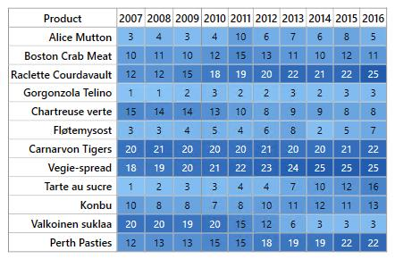

---
layout: post
title: About Syncfusion® UWP HeatMap Control | Syncfusion®
description: Learn about the introduction of Syncfusion Essential Studio® UWP HeatMap control, its features, capabilities, and more details.
platform: chart-sdk
control: SfHeatMap
documentation: ug
appliesto: UI Component Suite, Chart SDK
---

# About Syncfusion® UWP HeatMap Control

[Essential® HeatMap UWP](https://www.syncfusion.com/uwp-ui-controls/heatmap) visualizes tabular data by representing values with gradient colors instead of numeric text. Lower and higher values are displayed using different colors with varying gradients.

**Key features:**

* Two types of data source mapping: [TableMapping](https://help.syncfusion.com/cr/uwp/Syncfusion.UI.Xaml.HeatMap.TableMapping.html) and [CellMapping](https://help.syncfusion.com/cr/uwp/Syncfusion.UI.Xaml.HeatMap.CellMapping.html)
* Color mapping
* Legend
* Virtualization
